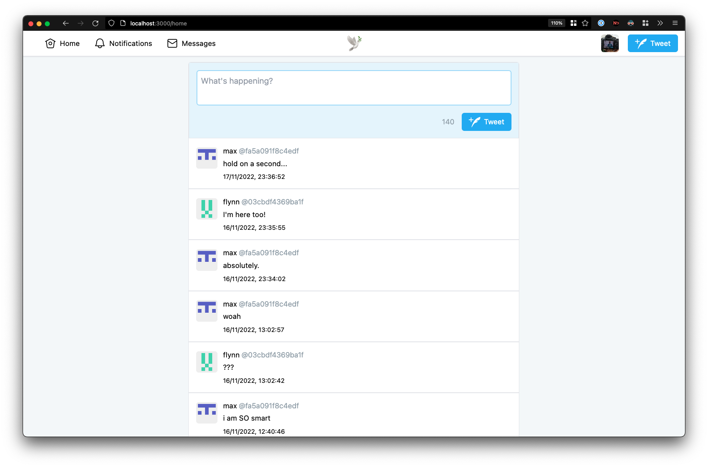

# twitter2

because you can build twitter over a weekend, right?

- [Tech Stack](#tech-stack)
- [What I've learnt](#what-ive-learnt)
- [Notes](#notes)
- [Attribution](#attribution)

## Tech Stack

- Tailwind
- TRPC
- Next.js
- NextAuth
- Prisma

I choose this stack solely because I am familar with it and wanted to build this out as fast as possible.

## What I've learnt

Sure, you can build out Twitter's basic functionality (tweets, likes, retweets, replies, profiles and so on...) within a short space of time. I knew this when I went into the project.

However, what you can't replicate:

- content moderation
- government compliance
- QA testing
- expertise in areas of your codebase

and the dedication of a team of people who are committed to the mission of your company.

## Notes

I have no intention to continue this project, and so code is provided as is and I probably won't get round to documenting what I have written. This project is under the MIT License, so go nuts (within the license's limitations, of course).

## Attribution

- [Edge Icons](https://github.com/yousefelgoharyx/edge-icons) by @yousefelgoharyx. These are a set of icons used in a 2018 version of Twitter, I use them for the Navbar and various other treats.
- The UserTweets model in the Prisma schema directly from [here](https://github.com/diego3g/node-prisma-twitter/blob/master/prisma/schema.prisma).
  - I couldn't figure out how the relationship between User and a follow model should work, so I sourced this model from @diego3g. Now I know for next time!
